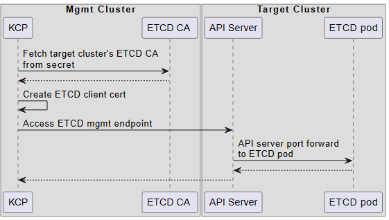
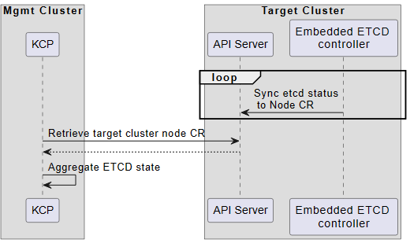
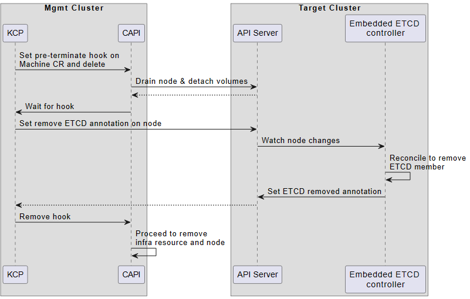

# Operate Managed ETCD in CAPI K3S provider

## CAPI Kubeadm provider (KCP) with Managed ETCD
Kubeadm controlplane provider is default provider for CAPI. It need access ETCD for below use cases:
### Case 1: Monitor ETCD state for Scale & Remediation preflight check.
KCP iterates target cluster's controlplane nodes, check if each etcd member has exact same members list, and if member alarms are empty. The ETCD health condition is attached on Machine CR, and then aggregate to KCP CR.

For Remediation operation, KCP make sure after remediation of target node, there are still enough healthy etcd members.

For Scale up/down operation, KCP make sure all ETCD members are healthy before scale.

### Case 2: Remove ETCD member before removing an controlplane node.
Before removing an controlplane node, KCP will first forward ETCD leadership and remove ETCD member for the node to be deleted. This is required, becuase if delete node directly, ETCD ring may get break (consider 2 node scale down to 1)

### Case 3: Reconcile ETCD members on controlplane CR reconcile loop.
KCP query ETCD members, and check if there is any member which don't have coresponding Controlplane Machine. Well, this is a bit confusing, when removing machine, ETCD member will get removed first, so  as there seems not possible to run into such conditions. Only possible case could be user manually operation on etcd ring?

### How KCP interact with Managed ETCD
CAPI mgmt cluster holds CA cert for target cluster's ETCD. When access target cluster ETCD, KCP create client cert and utilize apiserver port forwarding to establish channel to ETCD pod.


```plantuml
box "Mgmt Cluster"
participant "KCP" as kcp
participant "ETCD CA " as ca
end box
box "Target Cluster"
participant "API Server" as api
participant "ETCD pod" as etcd
end box

kcp -> ca: Fetch target cluster's ETCD CA\nfrom secret
ca --> kcp
kcp -> kcp: Create ETCD client cert

kcp -> api: Access ETCD mgmt endpoint
api -> etcd: API server port forward \nto ETCD pod
etcd --> api
api --> kcp

@enduml
```

## K3S Embedded ETCD Controller
K3S has embedded etcd controller which is responsible for managing ETCD lifecyle. Besides, it exposes ETCD status through "EtcdIsVoter" condition on Node CR, and also exposes manage operation interface through Node Annotation. 

Since K3S already has controller to manage ETCD, and provides interface for interaction, it's better K3S Provider utilize K3S ETCD controller to implement ETCD related operations. If it lacks some features, we shall consider contribute on K3S directly.

### Case1: Monitor ETCD state for Scale & Remediation preflight check.


```plantuml
box "Mgmt Cluster"
participant "KCP" as kcp
end box
box "Target Cluster"
participant "API Server" as api
participant "Embedded ETCD \ncontroller" as ctrl
end box

loop
ctrl -> api: Sync etcd status\n to Node CR
end

kcp -> api: Retrieve target cluster node CR
api --> kcp
kcp -> kcp: Aggregate ETCD state

@enduml
```


### Case 2: Remove ETCD member before removing an controlplane node.
Remove ETCD member is a bit complex. In current K3s design, to stop ETCD member, the kubelet on same node will be stopped as well. This may causes issue: After KCP remove ETCD member, CAPI can no longer drain node or detach volume since kubelet is already dead.

To solve the issue mentioned above, We propose a solution, leverage CAPI machine pre-terminite hook, postpone remove ETCD operation after drain node operation.


```plantuml
box "Mgmt Cluster"
participant "KCP" as kcp
participant "CAPI" as capi
end box
box "Target Cluster"
participant "API Server" as api
participant "Embedded ETCD \ncontroller" as ctrl
end box

kcp -> capi: Set pre-terminate hook on \nMachine CR and delete
capi -> api: Drain node & detach volumes
api --> capi
capi -> kcp: Wait for hook

kcp -> api: Set remove ETCD annotation on node
api -> ctrl: Watch node changes 
ctrl -> ctrl: Reconcile to remove\nETCD member
ctrl -> api: Set ETCD removed annotation
api --> kcp: 
kcp -> capi: Remove hook

capi -> capi: Proceed to remove \ninfra resource and node

@enduml
```

### Case 3: Reconcile ETCD members on controlplane CR reconcile loop.
We shall relies on K3s Embedded ETCD controller to reconcile etcd, and maintain health status

## See Also
[Kubeadm based control plane](
https://github.com/kubernetes-sigs/cluster-api/blob/main/docs/proposals/20191017-kubeadm-based-control-plane.md#scenario-3-three-replicas-one-unresponsive-etcd-member-one-different-unhealthy-machine)

[Machine deletion phase hooks](https://github.com/kubernetes-sigs/cluster-api/blob/main/docs/proposals/20200602-machine-deletion-phase-hooks.md)

[Remove K3s node by node annotation](https://github.com/k3s-io/k3s/discussions/9818)

[Access K3s ETCD mgmt endpoint](https://github.com/k3s-io/k3s/discussions/9841)